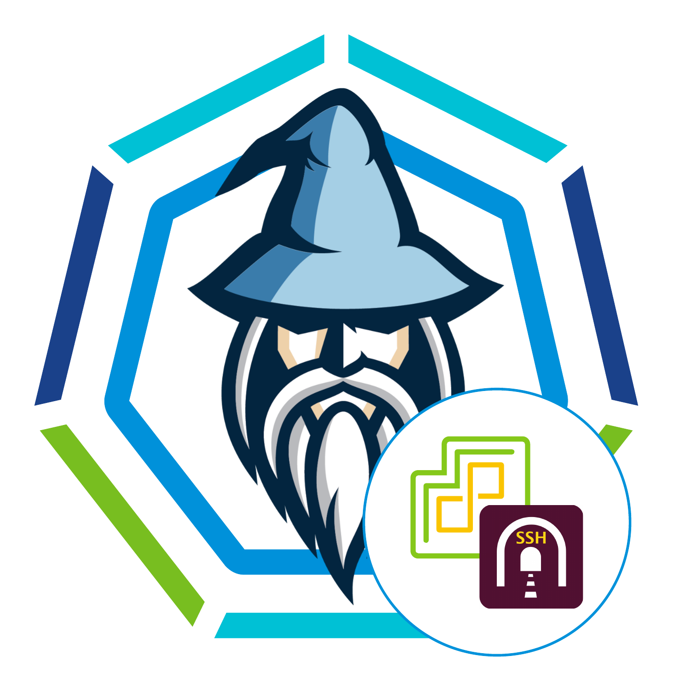

# vSphere with Tanzu Wizard



**Use this wizard to**
- Create TKG cluster (both in wizard mode or pipeline mode)
- Switch back and forth between supervisor and workload cluster with just 1 command.
- Use this docker image in your pipeline to create cluster
- Establish tunnel through bastion host (optional, if needed) in private cluster scenario


## Bootstrapped Quick start (recommended)

**Prep .env**
- `mv .env.sample .env`
- Fill out the details
    - BASTION_HOST={the jump or bastion host ip or name. OR leave it blank if you have direct access to kubernetes endpoint and do not need a bastion host}
    - BASTION_USERNAME={username for login into the above host. Leave it blank if there is no bastion host.}
    - TKG_SUPERVISOR_ENDPOINT={find the supervisor endpoint from vsphere (eg: Menu>Workload management>clusters>Control Plane Node IP Address)}
    - TKG_VSPHERE_CLUSTER_NAME={the k8s cluster your are trying to access}
    - TKG_VSPHERE_CLUSTER_ENDPOINT={endpoint ip or hostname of the above cluster. Grab it from your vsphere environment. (Menu>Workload Management>Namespaces>Select the namespace where the k8s cluster resides>Compute>VMware Resources>Tanzu Kubernetes Clusters>Control Plane Address[grab the ip of the desired k8s])}
    - TKG_VSPHERE_CLUSTER_USERNAME={username for accessing the cluster}
    - TKG_VSPHERE_CLUSTER_PASSWORD={password for accessing the cluster}
    - DEFAULT_CONTROL_PLANE_VM_CLASS=best-effort-small {A default value for convenience. change value suitable to your envrionment from here: https://docs.vmware.com/en/VMware-vSphere/7.0/vmware-vsphere-with-tanzu/GUID-7351EEFF-4EF0-468F-A19B-6CEA40983D3D.html}
    - DEFAULT_WORKER_NODE_VM_CLASS=best-effort-small {A default value for convenience. change value suitable to your envrionment from here: https://docs.vmware.com/en/VMware-vSphere/7.0/vmware-vsphere-with-tanzu/GUID-7351EEFF-4EF0-468F-A19B-6CEA40983D3D.html}
    - DEFAULT_STORAGE_CLASS="k8s-policy" {A default value for convenience when creating a new cluster via wizard. change it accordingly or keep the default as it is. https://docs.vmware.com/en/VMware-vSphere/7.0/vmware-vsphere-with-tanzu/GUID-4E68C7F2-C948-489A-A909-C7A1F3DC545F.html}
    - DEFAULT_SERVICES_CIDR_BLOCKS="10.96.0.0/12" {A default value for convenience when creating a new cluster via wizard. change it accordingly or keep the default as it is. https://docs.vmware.com/en/VMware-vSphere/7.0/vmware-vsphere-with-tanzu/GUID-4E68C7F2-C948-489A-A909-C7A1F3DC545F.html}
    - DEFAULT_POD_CIDR_BLOCKS="192.168.0.0/16" {A default value for convenience when creating a new cluster via wizard. change it accordingly or keep the default as it is. https://docs.vmware.com/en/VMware-vSphere/7.0/vmware-vsphere-with-tanzu/GUID-4E68C7F2-C948-489A-A909-C7A1F3DC545F.html }

**Prep Binaries**
- download `kubectl-vsphere` binaries from your vsphere (Menu>workload management>Namespaces>Select the namespace>Summary>Click link in the `Status` card) and place it in the Binaries directory

**Build and Run Docker**
```
docker build . -t k8stunnel
docker run -it --rm -v ${PWD}:/root/ --add-host kubernetes:127.0.0.1 --name k8stunnel k8stunnel /bin/bash
```

The above docker, based on the environment variable supplied, will
- Tunnel Wizard `~/binaries/tunnel.sh --help`
    - Create tunnel
    - Login into k8s workload cluster
    - open a shell access through tunnel
    - This wizard will let you switch back and forth between workload and management cluster with simple flags (*`--switch-to-supervisor` `--switch-to-workload`*).
    - The wizard will also let you login to other workload cluster with simple flags (*`--cluster-endpoint`, `--cluster-name`*)
    - The vsphere sso login is taken care of in the background
- Create Cluster Wizard `~/binaries/create-cluster.sh --help`
    - Create vSphere with Tanzu workload cluster
    - Wizard interface to create cluster that simpleflies the process.
    - launch this wizard using flag `~/binaries/create-cluster.sh --wizard`
    - OR, in a pipeline scenario pass parameters to create cluster. 


## That's it
...

...

...

...

..

...


***Read below if you want know how things are working under the hood***

# Do it yourself

### docker container
```
docker build . -t k8stunnel -f Dockerfile.tunnel
docker run -it --rm -v ${PWD}:/root/ --add-host kubernetes:127.0.0.1 --name k8stunnel k8stunnel /bin/bash
```
### Create ssh tunnel yourself
Once you are in the docker container shell, to create ssh tunnel run below:

`ssh -i /root/.ssh/id_rsa -4 -fNT -L 443:<supervisor cluster endpoint or ip>:443 ubuntu@10.79.142.40`

Example:

`ssh -i /root/.ssh/id_rsa -4 -fNT -L 443:192.168.220.2:443 ubuntu@10.79.142.40`

This will create ssh tunnel for login

Then to login into the workload k8s cluster using vSphere sso run

```
kubectl vsphere login --tanzu-kubernetes-cluster-name <workload cluster name> --server kubernetes --insecure-skip-tls-verify -u administrator@vsphere.local
kubectl config use-context <workload cluster name>
```

example:

```
kubectl vsphere login --tanzu-kubernetes-cluster-name tmc-cluster-c2 --server kubernetes --insecure-skip-tls-verify -u administrator@vsphere.local
kubectl config use-context tmc-cluster-c2
```

*Since our localhost domain is mapped to a domain called kubernetes and we have created tunnel between localhost and supervisor k8s cluster endpoint we need to use kubernetes instead.*

The above will generate config file in the .kube dir.

Modify the kubeconfig to point to 'kubernetes' instead of 'cluster endpoint or ip'.

in my case the jenkins-cluster ip was: 192.168.220.7
so changed https://192.168.220.7:6443 to https://kubernetes:6443


Then create ssh tunnel to workload k8s cluster

`ssh -i /root/.ssh/id_rsa -4 -fNT -L 6443:<workload cluster ip>:6443 ubuntu@10.79.142.40`

example:
`ssh -i /root/.ssh/id_rsa -4 -fNT -L 6443:192.168.220.7:6443 ubuntu@10.79.142.40`

check by running some kubectl commands

```
kubectl cluster-info
kubectl get nodes
kubectl get ns
```

### That's it. Your are ready to go.
Read through the below to understand why. 
Or blog post here: https://accordingtoalinahid.blogspot.com/2021/06/kubectl-using-ssh-tunnel-for-tkg-k8s.html


# The WHY and HOW (in details):

### Why bastion host?
It is a very common (and widely adopted) architecture pattern to have a bastion host in a private network scenario. 

In my case, I had few TKG (Tanzu Kuberneted Grid) clusters in my private cloud (Based on vSphere7) that I need to access for things like
- prep cluster for application. Such as namespace creation, policy configuration, RBAC, PVC, Secrets, Ingress setup etc.
- prep cluster and deploy Jenkins (see VMW/calcgithub/jenkins repo)
- test my application on dev k8s cluster before I created automated CICD for it.
- I just like to do kubectl on cluster for fun.
and many more reasons.  

Problems with private clusters is:
- There's no way to access it without getting on to private network.
- to 'access pvt k8s clusters' I could 
    - Either get on to a VPN (this is a lot of work for network admin)
    - OR **access a bastion** which is inside the pvt network but has an external ip. (bastion is simple and easy to setup). In my case the pvt network is completely inaccessible even with VPN. Bastion's "external ip" is only accessible via VPN.

Thus bastion host is a great way to access private k8s clusters. 
Bastion host itself to do 'bastion'/'jumpbox' stuff does not need much (eg: only need lean linux, ssh server, firewall, pub key etc); doesn't even need GUI or any standard linux tools either.

### What is the problem with bastion?
Although bastion is a great way to access private network's resource (in this case k8s cluster) there are few issues with it like:
- **toolset**: I need kubectl and kubectl-vsphere installed on bastion. I need VScode so that I nicely edit/create yaml files for my k8s stuff. I need nano. I need less. I need chrome to google stuff etc etc. In order to use them I need lot of prep on bastion and then bastion will not be bastion anymore it will become another giant VM.
- **laggy connection**: Typing on shell prompt where the letters appears after I typed (I type fast bro!!) is simply annoying and frustrating. Infact I loose productivity just because of it.
- **files transfer/files**: I create k8s files in my machine using VSCode just like a project source codes. Infact some k8s files are in my application source code (eg: deployment.yaml) that I do plan to use during CD pipeline BUT I at initial stage so I will deploy using kubectl deploy for now. Transfering these files back and forth (as I make changes to these files) between my dev machine and bastion host is a HASSLE I will avoid at all cost. It hinders productivity significantly, boils frustration --> just not nice. I have 100 problems to solve and don't want this one to be one of them.

### So, what's the solution? = Tunnel through Bastion 
Use ssh tunnel through bastion instead of ssh'ing into bastion.
Use all the tools, files etc that you need and keep them on your dev machine/container/vm/git BUT exetue commands to remote private k8s cluster. Also avoid the annying laggy connection issues.

Life is short -- type fast, save time by avoiding transfers, vi (cause I hate it), use VScode --- enjoy coffee, not just drink it.

### What's the difference with TKG cluster?
kubectl through bastion tunnel is pretty common and widely adopted practice. Then, why am I writting this post? Well there's a tiny difference (more like a 'how it is with TKG clusters') with TKG k8s cluster when tunneling though bastion compared to a vanilla k8s cluster. (AND this is true for any managed clusters scenario).

TKG clusters uses SSO authentication with vSphere users (with different roles of course). Hence, unlike vanilla k8s cluster there's no `client-certificate-data` and `client-key-data` under `users` section for any `user` entry in the `.kube/config` file. `kubectl-vsphere` generates the `.kube/config` file during `kubectl-vsphere login` using sso user login. This process generates a `token` instead of cert-key for users. It also needs an additional 443 port forward for login purpose.

Hence, the tunnelling process is tiny bit different TKG clusters. 

### But this is a container (not laptop). Why so?

*Why am I using container to deploy container/k8s which is a container orchestration?* == Inception much!!

My reasons are:
- I treat container just like a VM but only very light weight.
- This way my dev projects do not get mixed up with dependencies and burden my host machine / laptop.
- The only thing in need on my host machice is docker; that's it.
- With VScode remote debugging I feel absolutely 0 difference that I am doing live dev in container.
- I can change my host machine and get my dev environment going in 10 mins time.
- My dev environment are super portable with container.
- If I mess up things I simply destroy the container and re-create it (it's like having a 'eraser for life')
- They run the same on windows, linux, mac. So I can do dev either on work machine or personal machine makes no difference and best part: I dont need a dev environment setup on any; just build docker and I am ready to go.

So use this k8stunnel container for tunneling and enjoy the difference. 
This is like providing you with a bootstrapped environment for TKG cluster tunneling through bastion.


# Tunnel through Bastion for TKG cluster

## The process
1. create a ssh tunnel to tkg/"vSphere with Tanzu" management cluster for login
2. login using kubectl-vsphere login (vSphere sso)
3. the login will generate .kube/config. Edit this to point to k8s Subject Alternative Name DNS.
4. create a ssh tunnel to tkg workload cluster
5. That's it. Use kubectl as you normally would on your local machine but execute these kubectl commands to a private remote TKG k8s cluster tunnling through bastion.

## Some prepwork for this dev container

#### RSA file for ssh (optional) 
if you do not use insecure password based ssh, use pub/pvt key instead.
in this case 
- I generate key pair (public and private).
- uploaded the public key file's content to my bastion host's ~/.ssh/authorized_keys (or upload .pub file and rename to authorized_keys. file permission should be -rw-rw-r--  1 ubuntu ubuntu where ububtu is the user I used to ssh. to ~/ is ububtu's home dir)
- placed the private key file (id_rsa) in .ssh/ directory (which is volume mounted to container)

**NOTE:** to avoid unprotected private key error do `chmod 600 tunnel/.ssh/id_rsa` (this is already taken care of in the Dockerfile)


### Create an empty .kube/config file here

do `touch .kube/config` inside tunnel directory.
Check "login to k8s workload cluster" section to know why.


### Read the docker file

the docker file is doing few things


### Build & run docker

```
cd tunnel
docker build . -t k8stunnel
docker run -it --rm -v ${PWD}:/root/ --add-host kubernetes:127.0.0.1 --name k8stunnel k8stunnel /bin/bash
```

*Captain obvious says: You only need to build once, then just keep running it to use it for your tunneled kubectl.*

The docker run command will run the container and open shell access in the container.


## From here onwards we will execute all commands inside the container (using he container's OS debian:buster-slim shell).


## SSH Tunnel and Kubectl to remote TKG pvt Clusters


### Create tunnel through bastion for login

```
ssh -i /root/.ssh/id_rsa -4 -fNT -L 443:192.168.220.2:443 ubuntu@10.79.142.40
```

**Here:**

port:443--> 443:192.168.220.2:443 --> create a tunnel for port 443 in localhost to talk to remote's (192.168.220.2, which is tkg management cluster ip; grab this ip from vSphere > Menu > Workload Management > Clusters > Controlplane node ip address) via bastion host 10.79.142.40.

This tunnel will allow to login into k8s cluster via vsphere sso login using tkg management cluster.


### Login to k8s workload cluster

```
kubectl-vsphere login --insecure-skip-tls-verify --server kubernetes -u administrator@vsphere.local --tanzu-kubernetes-cluster-name tkg-cluster
```
This will put content in .kube/config file or if you haven't created an empty file called config in '.kube/' it will create one, but if it is created by kubectl-vsphere then you won't have view/edit permission from host computer (your laptop). In my case I created an empty .kube/config (note: .kube is also volume mounted to container.)


### Edit the kubeconfig for kubectl tunnel

This is so that instead of connecting to the remote k8s cluster endpoint it connects to localhost (because when ssh tunneling is established the localhost will be listening to the port and it will pass through to bastion host 10.79.142.40 and reach to k8s cluster endpoint)


In the .kube/config file the tkg workload cluster's ip was 192.168.220.4 --> Change this workload cluster's endpoint (192.168.220.4) to the workload cluster's `Subject Alternative Name DNS` called 'kubernetes' (with the docker run command we are already binding 127.0.0.1 to kubernetes in /etc/hosts; thus pointing to localhost; check nano /etc/hosts file).


ONLY change the entry under `clusters.server`. which in my case, before I changed, looked something this like: https://192.168.220.4:6443.


DO NOT CHANGE any other occurances of 192.168.220.4 in the ./kube/config.


For example:

before change:
```
clusters:
- cluster:
    certificate-authority-data: <dacted cert data>
    server: https://192.168.220.4:6443
  name: 192.168.220.4
```
after change:
```
clusters:
- cluster:
    certificate-authority-data: <dacted cert data>
    server: https://kubernetes:6443
  name: 192.168.220.4
  ```


### Create tunnel through bastion for kubectl'ing on workload cluster

```
ssh -i /root/.ssh/id_rsa -4 -fNT -L 6443:192.168.220.4:6443 ubuntu@10.79.142.40
```
**Here:**

port:6443--> 6443:192.168.220.4:6443 --> create a tunnel for port 6443 (which is also k8s default api endpoint port) in localhost to talk to remote's (192.168.220.4, which is tkg workload cluster's ip; grab this ip from .kube/config file generated by kubectl-vsphere) via bastion host 10.79.142.40.


# That's it

After this you should be able to do usual kubectl.
Test by running 
- `kubectl cluster-info` or 
- `kubectl get nodes` or 
- `kubectl get ns`
You should be able to see response from your remote k8s cluster.


### Some common questions

***Explaing the tunnel params?***
- 10.79.142.40 is my jumpbox. And the username to ssh (tunnel) is ubuntu.
- ssh tunnel using privatekey (bastion 10.79.142.40 has the public key in its .ssh/authorization_keys file)
- -fNT -L --> where 
    - f=forks to the background
    - N=tells ssh not to execute any command after it connects to the remote server
    - L=local port forwarding
- -4 enforces ssh to use ipv4
- Since k8s api endpoint is at 6443 (default) so I am going to create a localport 6443 and listen to 192.168.220.2:6443
- finally the last param is the accessible ip of the bastion. (in this case this ip is my company's internal ip, hence I can only access this when I am on VPN. Your bastion's accessible ip will be different)

***Why use Subject Alternative Name DNS instead of 127.0.0.1?***

If I had edited it to 'https://127.0.0.1:6443' instead of 'https://kubernetes:6443' (because at the end of day we want the kubectl command to execute against the localhost so that localhost can port forward to remote host) it would have thrown this error: `unable to connect to server: x509: certificate is valid for 192.168.220.4, not 127.0.0.1`. This is because the cert that's associated with k8s cluster endpoint doesn't know anything about 127.0.0.1, so it's rejecting it. 


I resolved this issue by

- using Subject Alternative Name DNS in the .kube/config --> this way kubectl/k8s endpoint will check cert validity against DNS name (which the cert knows about. How? see *How did I get the cluster's Subject Alternative Name DNS?* section)
- having `127.0.0.1 kubernetes` entry in the `/etc/hosts` file. (I did this during docker run command using `add-hosts` param). By having this entry in the host file I am essentially enabling so 'kubernetes' is resolved to '127.0.0.1' which forwards to '192.168.220.4' on 6443 port via bastion (10.79.142.40).


***How did I figure out workload cluster's ip = 192.168.220.4?***

Good question. There's basically 2 signs:
After the config file is created,
1. Only 1 cluster entry under `clusters` section with `certificate-authority-data`. The rest are with `insecure-skip-tls-verify: true`. This is `kubectl-vsphere`'s doing because we told it to `--insecure-skip-tls-verify` so for management cluster entry is assigned `insecure-skip-tls-verify: true` and it auto created a cert and auth token for user for workload cluster we specified via `--tanzu-kubernetes-cluster-name` (which is in this case tkg-cluster).
2. Under `contexts:` section find the `context` where `context.name` = our workload cluster name (tkg-cluster). We supplied the cluster name via `--tanzu-kubernetes-cluster-name tkg-cluster`. Notice the value of `cluster` here. This should be the workload cluster's IP .


***How did I get the cluster's Subject Alternative Name DNS?***

Usually all TKG k8s clusters shold have the below Subject Alternative Names DNS entries:
- kubernetes
- kubernetes.default
- kubernetes.default.svc
- kubernetes.default.svc.cluster.local
- kubernetes-control-place-<generated number by TKG> (which you can get by looking at the controlplane VM name of the cluster)


I chose 'Kubernetes' becuase I am going to do this tunnelling in a docker container (meaning I will only use this container most likely for one cluster only) I could just use kubernetes and not worry about conflicting with other clusters.


If you want to double check this for your cluster you can do so by:
- ssh'ing into the controlplane node
    - ssh into bastion host (aka jumpbox).
    - follow this documentation here for ssh'ing into controlplane node: https://docs.vmware.com/en/VMware-vSphere/7.0/vmware-vsphere-with-tanzu/GUID-37DC1DF2-119B-4E9E-8CA6-C194F39DDEDA.html
- AND inspecting the apiserver.crt file.
    - once you're logged in then run the following commands:
        - `cd /etc/kubernetes/pki`
        - `ls -l` --> and notice the apiserver.crt in the directory
        - `openssl x509 -noout -text -in apiserver.crt` --> inspect/check/see the content of the cert.
    - the apiserver.crt contains a section `x509v3 Subject Alternative Name:`. Under this section see DNS entries (comma separated). 'kubernetes' should be one of them


#### handy commands

SCP to upload download files from remote/bastion
```
kubectl delete TanzuKebernetesCluster tanzu-cluster-name
scp -i tunnel/.ssh/id_rsa ubuntu@10.79.142.40:/path/to/remote/file /path/to/local/file
netstat -ntlp | grep 6443`
fuser 6443/tcp`
```


```
tmc cluster create -t tkgs --name sampletmc --cluster-group anahid --management-cluster-name anahid-vsphere7-onecloud --provisioner-name tkg --worker-node-count 2 --instance-type best-effort-small --allowed-storage-classes k8s-policy --storage-class k8s-policy --version v1.20.2
```